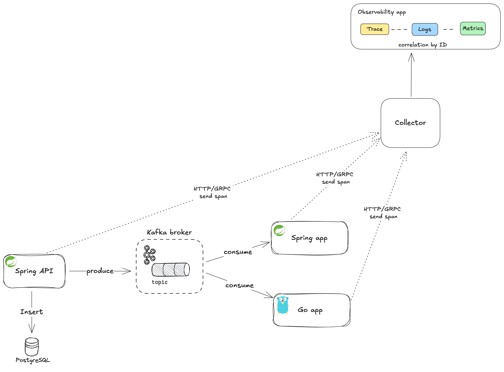

# Microservices Architecture with OpenTelemetry Tracing

This project demonstrates a distributed microservices architecture with multiple components working together to handle HTTP requests, database interactions, and messaging using Kafka. OpenTelemetry is used for end-to-end tracing, allowing the complete flow of requests to be visualized in Jaeger.

## Architecture Overview

### Components:
1. **Spring Boot API Service (`api-service`)**:
    - Exposes a REST endpoint (`/api/v1/student`) to receive POST HTTP requests.
    - Inserts the data into a relational database (PostgreSQL).
    - Publishes the data as a message to a Kafka topic (`student`).
    - Sends OpenTelemetry spans to a collector.

2. **Spring Boot Kafka Consumer Service (`spring-kafka-consumer`)**:
    - Listens to the `student` Kafka topic.
    - Consumes the messages published by the `api-service`.
    - Processes the messages and sends OpenTelemetry spans to a collector.

3. **Go Kafka Consumer Service (`go-kafka-consumer`)**:
    - Listens to the `student` Kafka topic.
    - Consumes the same messages published by the `api-service`.
    - Prints the message and logs its trace details.
    - Sends OpenTelemetry spans to a collector.

### Observability Stack:
- **Uptrace**:
    - A distributed tracing and performance monitoring tool built on top of OpenTelemetry.
    - Collects and visualizes distributed tracing information from all microservices, allowing for monitoring of application performance and system dependencies.
    - Displays complete traces for every incoming HTTP request, including database operations, message queues like Kafka, and other services involved in the request flow.
    - Offers rich insights into latency, error rates, and request performance, helping to diagnose and resolve issues more efficiently.

### Architecture Diagram:




## Components and Flow Details

### 1. Spring Boot API Service (`api-service`)

- **Functionality**:
    - Receives POST HTTP requests at `/api/v1/student`.
    - Inserts the received data into a PostgreSQL database.
    - Publishes a Kafka message with the same data to the topic `student`.

- **OpenTelemetry Integration**:
    - Traces the incoming HTTP request.
    - Adds spans for database insertion operations.
    - Adds spans for the Kafka message production.
    - Passes the tracing context to the Kafka message headers.

- **Example Request**:

```bash
  curl -X POST http://localhost:8080/api/v1/student \
    -H "Content-Type: application/json" \
    -d '{"firstname": "Gaspard", "lastname": "Proust"}'
```

- **Spans Produced**:
    - `HTTP POST /api/v1/student`
    - `Database Insert`
    - `Kafka Produce to student topic`

### 2. Spring Boot Kafka Consumer (`spring-app-consumer`)

- **Functionality**:
    - Listens to the Kafka topic `student`.
    - Consumes messages and processes the data.
    - Prints the received message and processes it.

- **OpenTelemetry Integration**:
    - Traces the message consumption.
    - Creates a new span for each consumed message.
    - Links the span with the original trace using Kafka message headers.

- **Spans Produced**:
    - `Kafka Consume from student`
    - `Message Processing`

### 3. Go Kafka Consumer (`go-consumer`)

- **Functionality**:
    - Listens to the Kafka topic `student`.
    - Consumes the messages published by the `api-service`.
    - Logs the received message details.

- **OpenTelemetry Integration**:
    - Traces the message consumption.
    - Links the span with the original trace using Kafka message headers.

- **Spans Produced**:
    - `Kafka Consume from student`
    - `Log Message Details`
