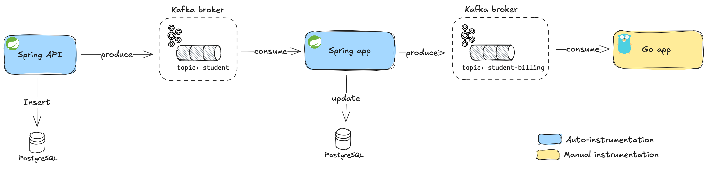
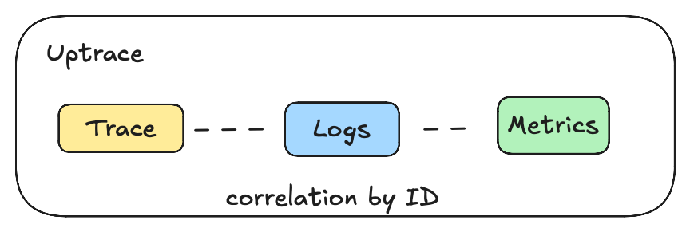
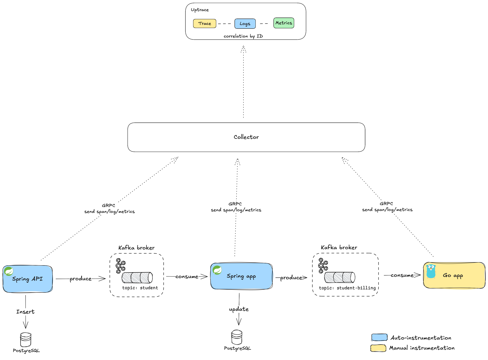
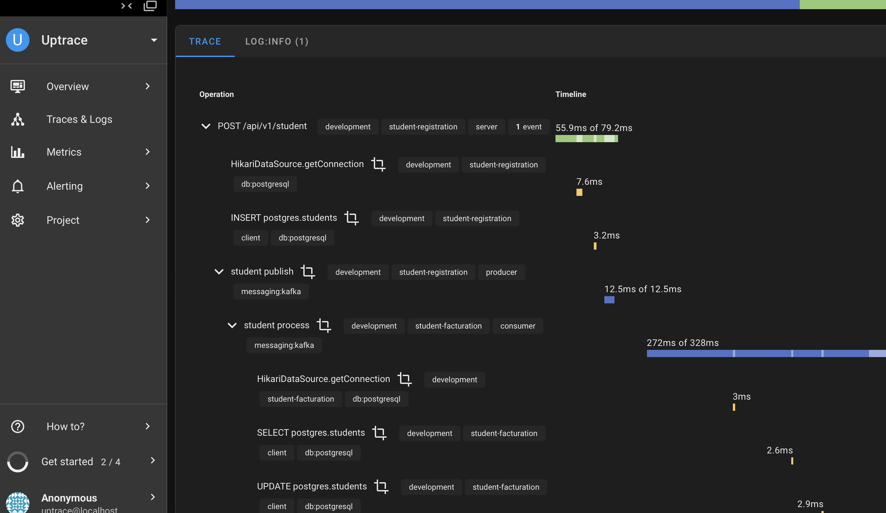
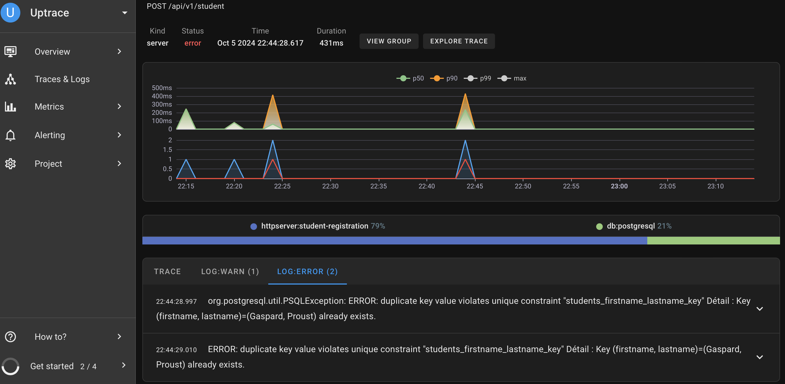
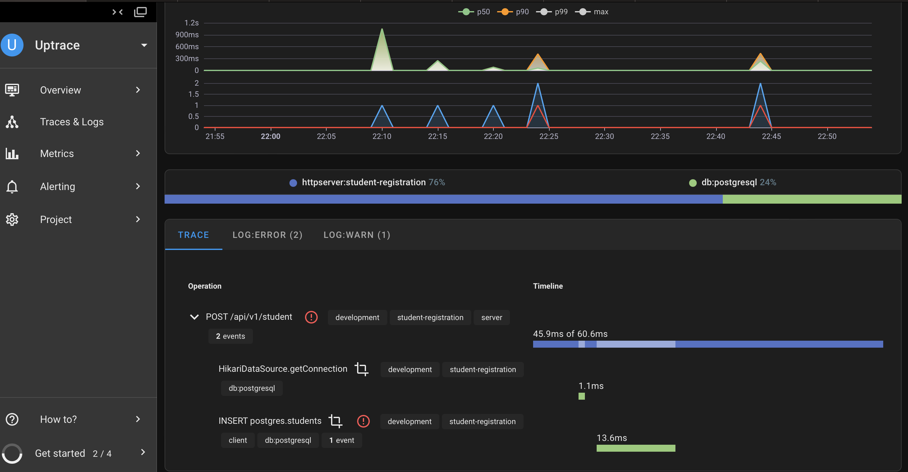

# Microservices Architecture with OpenTelemetry Tracing

This project demonstrates a distributed microservices architecture with multiple components working together to handle 
HTTP requests, database interactions, and messaging using Kafka. 
OpenTelemetry is used for end-to-end tracing, allowing the complete flow of requests to be visualized in Jaeger.

In this project, there are two types of instrumentation: **auto-instrumentation with library** and **manual instrumentation**.

**1. Auto-Instrumentation**

**Auto-instrumentation** refers to the automatic tracing of common operations (such as HTTP requests, database queries, and Kafka messaging) without the need to modify the application code. OpenTelemetry provides libraries that can automatically trace these operations.

- **How it works**: By adding the OpenTelemetry libraries to your application, they hook into existing frameworks and automatically generate spans and metrics for various operations (e.g., HTTP requests, database interactions, message queues like Kafka).

- **Example in this project**:
    - The **Spring Boot API Service** (`api-service`) and **Spring Boot Kafka Consumer Service** (`spring-kafka-consumer`) use OpenTelemetry’s auto-instrumentation for tracing HTTP requests, database interactions (PostgreSQL), and Kafka message production/consumption.

**2. Manual Instrumentation**

**Manual instrumentation** is when you explicitly add tracing or metrics to specific parts of your code using OpenTelemetry APIs. This gives you full control over which operations are traced and allows you to add custom attributes or spans.

- **How it works**: You manually create spans, define attributes, and link traces for the operations that you want to monitor.

- **Example in this project**:
    - The **Go Kafka Consumer Service** (`go-kafka-consumer`) uses **manual instrumentation** to trace Kafka message consumption. Each message is manually traced, and spans are linked to the original trace using Kafka headers.


## Running the Project

To get started with this project, you can easily set up and run the services using Docker Compose. Follow the steps below:

### 1. Start the Services

Make sure you have Docker and Docker Compose installed on your machine. Then, navigate to the project directory and run the following command to start all services in detached mode:

```bash
docker-compose up -d
```
```bash
  curl -X POST http://localhost:8080/api/v1/student \
    -H "Content-Type: application/json" \
    -d '{"firstname": "Gaspard", "lastname": "Proust"}'
```

### Kafka UI

- **Service Name**: `kafka-ui`
- **Access URL**: [http://localhost:8090](http://localhost:8090)
- **Description**: Kafka UI is a web-based interface for managing and monitoring Apache Kafka clusters, allowing users to view topics, consumer groups, and messages easily.

---

### Uptrace

- **Service Name**: `uptrace`
- **Access URL**: [http://localhost:14318](http://localhost:14318)
- **Description**: Uptrace is a distributed tracing and performance monitoring tool that provides insights into the performance and behavior of microservices, enabling effective monitoring and troubleshooting.

## Architecture Overview


### Observability Stack:


- **Uptrace**:
    - A distributed tracing and performance monitoring tool built on top of OpenTelemetry.
    - Collects and visualizes distributed tracing information from all microservices, allowing for monitoring of application performance and system dependencies.
    - Displays complete traces for every incoming HTTP request, including database operations, message queues like Kafka, and other services involved in the request flow.
    - Offers rich insights into latency, error rates, and request performance, helping to diagnose and resolve issues more efficiently.

### Architecture Diagram:


## Components and Flow Details

### 1. Spring Boot API Service (`api-service`)

- **Functionality**:
    - Receives POST HTTP requests at `/api/v1/student`.
    - Inserts the received data into a PostgreSQL database.
    - Publishes a Kafka message with the same data to the topic `student`.

- **OpenTelemetry Integration**:
    - Traces the incoming HTTP request.
    - Adds spans for database insertion operations.
    - Adds spans for the Kafka message production.
    - Passes the tracing context to the Kafka message headers.

- **Example Request**:

```bash
  curl -X POST http://localhost:8080/api/v1/student \
    -H "Content-Type: application/json" \
    -d '{"firstname": "Gaspard", "lastname": "Proust"}'
```

- **Spans Produced**:
    - `HTTP POST /api/v1/student`
    - `Database Insert`
    - `Kafka Produce to student topic`

### 2. Spring Boot Kafka Consumer (`spring-app-consumer`)

- **Functionality**:
    - Listens to the Kafka topic `student`.
    - Consumes messages and processes the data.
    - Update the student table with student fees appropriate.
    - Publishes the student entity with fees as a message to a Kafka topic (`student-billing`).
    - Processes the messages and sends OpenTelemetry spans to a collector.

- **OpenTelemetry Integration**:
    - Traces the message consumption.
    - Creates a new span for each consumed message.
    - Links the span with the original trace using Kafka message headers.

- **Spans Produced**:
    - `Kafka Consume from student`
    - `Message Processing`

### 3. Go Kafka Consumer (`go-consumer`)

- **Functionality**:
    - Listens to the Kafka topic `student-billing`.
    - Consumes the messages published by the `spring-app-consumer`.
    - Logs the received message details.

- **OpenTelemetry Integration**:
    - Traces the message consumption.
    - Links the span with the original trace using Kafka message headers.

- **Spans Produced**:
    - `Kafka Consume from student-billing`






